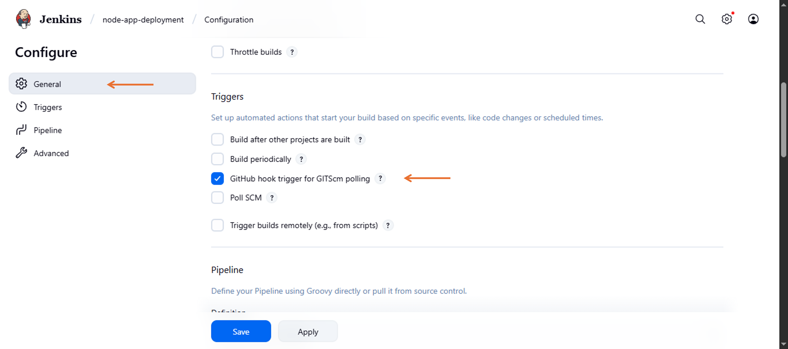

# Deployed a Node JS Application Using Jenkins CICD Pipeline

This Project Demonstrate a full CI/CD (Continuous Integration and Continuous Deployment) pipeline for a Node.js application using Jenkins Declarative Pipeline syntax. The objective is to automate the process of building, testing, and deploying the application with minimal manual intervention, ensuring consistent and reliable software delivery.

## Project Objectives

- Automate the full build, test, and deployment lifecycle for a Node.js application.

- Set up Jenkins to trigger pipelines on Git repository changes.

- Define a structured CI/CD workflow using Jenkins Declarative Pipeline (`Jenkinsfile`).

- Securely deploy code to a remote server via SSH using Jenkins credentials.

- Create reusable and maintainable CI/CD pipeline documentation.

## Step → 1 : Sign in into Amazon Web Services Console

login to the Amazon Web Services Console using your credentials.


## Step → 2 : Create Two AWS EC2 Instance

In the AWS Management Console search bar, enter EC2, and click the EC2 result under Services:

1. **Jenkins Server Setup :**

- Click on Instances → Create instance
  
- Choose :

  - **AMI** → Ubuntu
  - **Instane type** → Select t2.micro (free tier)
  - **Key pair** → Create or use existing one
  - **Security Group** → Allow HTTP (port 80), SSH (port 22) And `Jenkins (port 8080)`
- Launch Insatnce

2. **Node server Setup :**

- Click on Instances → Create instance

- Choose:
  - **AMI** → Ubuntu
  - **Instane type** → Select t2.micro (free tier)
  - **Key pair** → Create or use existing one
  - **Security Group** → Allow HTTP (port 80), SSH (port 22) And `Node (port 3000)`
- Launch Insatnce


## Step → 3 : Connecting Instance Using SSH

```sh
ssh -i <private-key> ubuntu@<public-IP>
```

## Step → 4 : Install Jenkins on Jenkins Server

- Jenkins is built on Java so, to install Jenkins we first need to install Java on the ubuntu server

- Run the below command on the jenkins

```sh
sudo apt update
sudo apt install openjdk-17-jdk -y
java --version
```

- Now, Run the below commands on the Jenkins for jenkins Installation

```sh
sudo wget -O /etc/apt/keyrings/jenkins-keyring.asc \
https://pkg.jenkins.io/debian-stable/jenkins.io-2023.key
echo "deb [signed-by=/etc/apt/keyrings/jenkins-keyring.asc]" \
https://pkg.jenkins.io/debian-stable binary/ | sudo tee \
/etc/apt/sources.list.d/jenkins.list > /dev/null
sudo apt-get update
sudo apt-get install jenkins
```

- Now, Start and Enable Jenkins

```sh
sudo systemctl Start Jenkins
sudo systemctl enable Jenkins
```

## Step → 5 : Install Nodejs on server

- Following Installation Commands :

```sh
sudo apt update
```

- Install Node.js (LTS) from NodeSource

```sh
curl -fsSL https://deb.nodesource.com/setup_lts.x | sudo -E bash -
```


```sh
sudo apt-get install -y nodej
```


- Install node dependencies

```sh
sudo apt install npm
```


- Install PM2 globally for Jenkins user

```sh
sudo npm install -g pm2
```


- Check Install or not :

```sh
node -v
npm -v
pm2 -v
```


## Step → 6 : Copy Private Key On Jenkins Server

```sh
scp -i jenkins-key.pem jenkins-key.pem ubuntu@<public-IP>:/home/ubuntu
```

## Step → 7 : Install Plugins

Go to Jenkins Dashboard → Settings → Plugins → Install Plugin


- ssh-agent


- github


## Step → 8 : Sign in Into Jenkins server and Create New credentials

Go to Manage Jenkins → Credentials

Add a new SSH Username with private key


Click → Global


Global Credentials - add Credentials


Choose:
Kind → SSH Username with private key

ID → node-app-key

Username → ubuntu

Private Key → Enter your private key directly or upload it

Click → Create


## Step → 9 : Create a New Job

Click → New Item


Enter a Job Name → Node-app-deployment

Select → Pipeline (recommended for full CI/CD)

CLick → OK




Select :

Source Code Management

Choose → Git

Enter your GitHub repo URL (e.g., <https://github.com/yourname/java-ci-app.git>)


Select → Branch → Master

Script Path → Jenkinsfile (or specify a subfolder path)

Click on → Save


## Step → 10 : Build a Job

Click → Build Now


Check Console Output to monitor logs

If tests pass and the package is successful, your deployment step should execute


## Step → 11 : Add Github Webhook

- Github repo → Settings → Webhook → Payload URL → <http://jenkins-server-public-IP:8080/github-webhook/> → Add Webhook


## Step → 12 : Enter the Public IP Address and port number in a web browser to view the deployed app

*Node js Application Was successfully Deployed!!!*


## Summary

This project shows how to set up a complete CI/CD pipeline for a Node.js app using Jenkins. The pipeline helps automate the process of checking the code, installing packages, running tests (if needed), and deploying the app to a server.

The steps are written in a file called Jenkinsfile, which Jenkins reads and follows. Whenever you push new code to Git, Jenkins pulls the changes, updates the app on the server, and restarts it using a tool like PM2.

This setup makes it easier and faster to deliver updates, avoid manual errors, and follow good DevOps practices.
